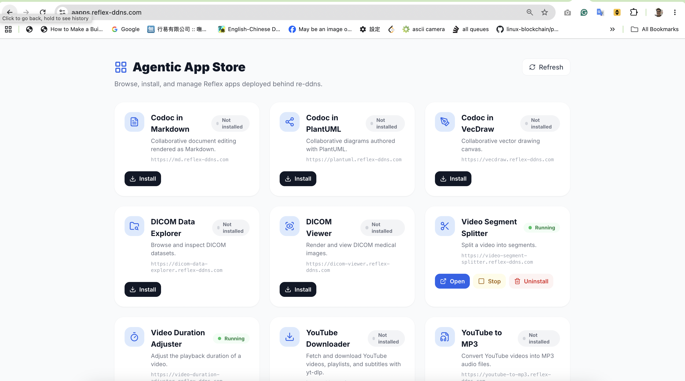
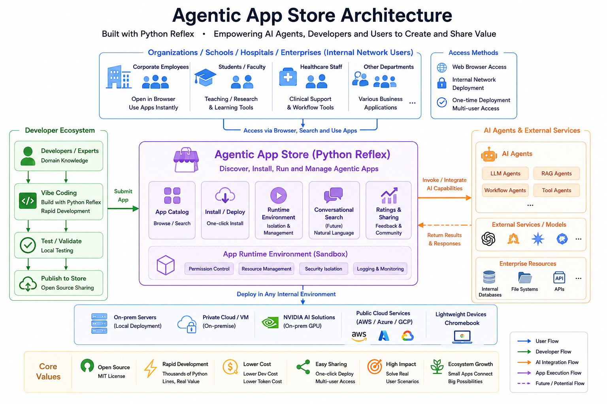
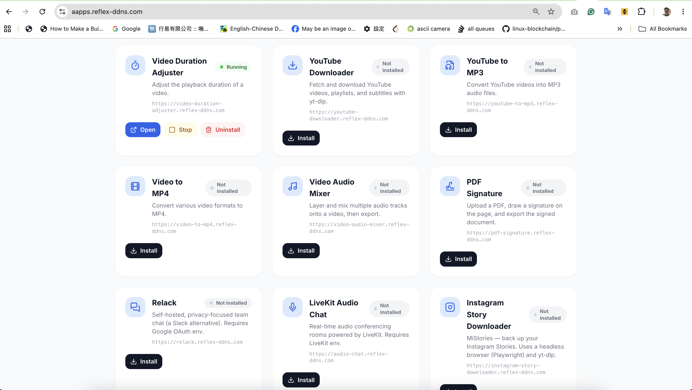
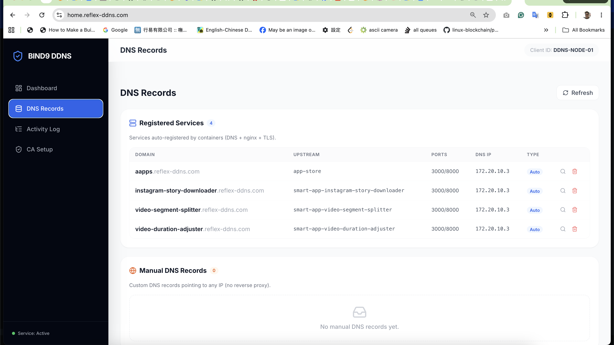
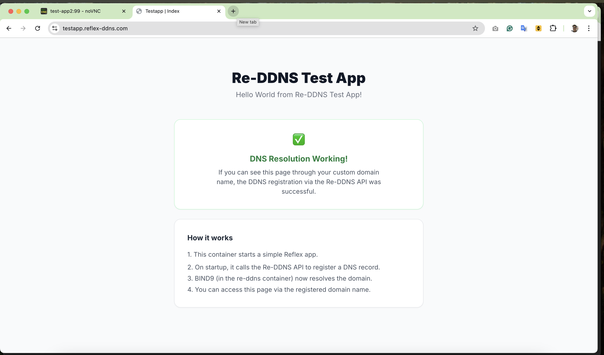
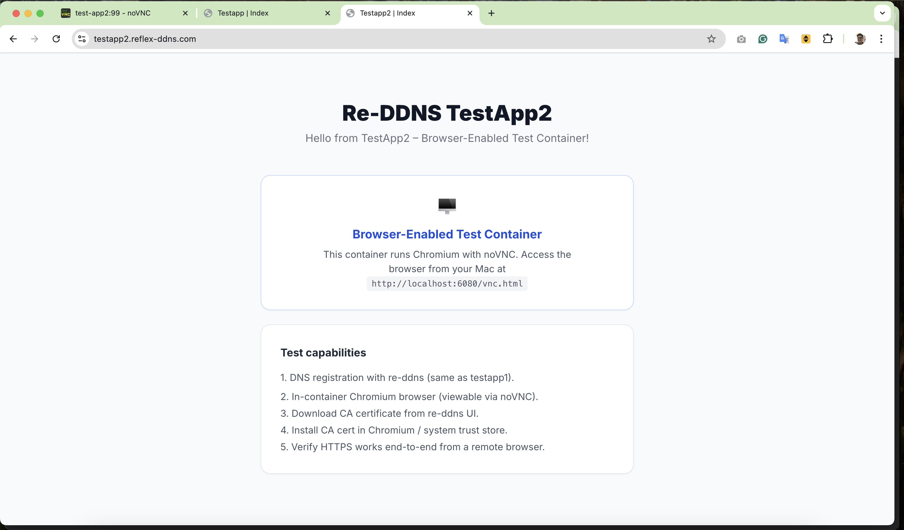
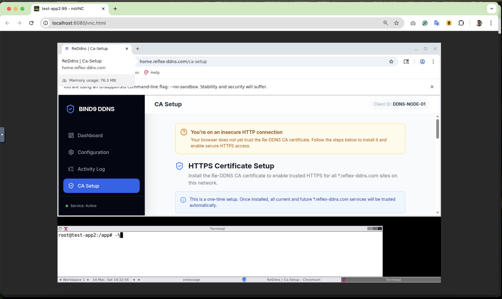

# Re-DDNS — Private HTTPS Infrastructure + Agentic App Store

> **TL;DR** — Run one script. Get a local HTTPS network where every Reflex app gets its own `https://<name>.reflex-ddns.com` with a green padlock. Then open the **Agentic App Store** and install apps from GitHub in one click — no shell commands needed.

> Before working on this project, read [AGENTS.md](AGENTS.md) for required workflows and tooling expectations.

---

## 1-Minute Demo

<p align="center">
  <a href="docs/videos/AgenticAppStore-1min-demo.mp4">
    
  </a>
  <br><em>▶ Click to open the 1-minute demo video</em>
</p>

*(Local file: [docs/videos/AgenticAppStore-1min-demo.mp4](docs/videos/AgenticAppStore-1min-demo.mp4))*

---

## What It Does

Re-DDNS is a **self-hosted deployment platform** that runs entirely in Docker on your Mac (or Linux host). It wires together four components automatically:

| Component | Role |
|-----------|------|
| **BIND9** | Authoritative DNS — resolves `*.reflex-ddns.com` to your machine |
| **nginx** | Unified HTTPS reverse proxy — one TLS terminator for every app |
| **Local CA** | Self-signed Certificate Authority — issues trusted certs for each subdomain |
| **Agentic App Store** | Browser UI to browse, install, start, stop, and uninstall apps |

Any [Reflex](https://reflex.dev) application hosted on GitHub can be deployed here by pointing the App Store (or an AI agent) at its repo URL. The platform handles DNS registration, certificate issuance, and reverse-proxy config automatically — **zero host shell commands needed after first setup**.

---

## Screenshots

<p align="center">
  
</p>

<table>
  <tr>
    <td></td>
    <td></td>
  </tr>
  <tr>
    <td align="center">App Store — one-click install with live progress</td>
    <td align="center">App Store — 20+ apps in the catalog</td>
  </tr>
</table>

<p align="center">
  
</p>
<p align="center"><em>Re-DDNS control panel — live view of all registered services and DNS records</em></p>

---

## Quick Start (Run From Zero)

The fastest path from nothing to a fully working HTTPS environment with the App Store running:

```bash
./rerun_from_zero.sh
```

This interactive script handles every step:

1. **Environment check** — verifies Docker, `curl`, `dig`, and all required files
2. **Docker Desktop** — waits for the daemon and starts it if needed
3. **Port 53** — guides you to free the port from macOS `mDNSResponder`
4. **Build & launch** — runs the full Docker stack (re-ddns + App Store + test apps)
5. **Backend verify** — confirms every service returns HTTPS 200 using `--resolve`
6. **Mac DNS** — runs `macos_set_dns.sh --join` so `*.reflex-ddns.com` resolves on your Mac
7. **CA trust** — installs the Local CA into your Mac's System Keychain (green padlock!)
8. **Final check** — verifies DNS, HTTPS, and CA trust end-to-end

After it completes, open your browser:

| URL | What you get |
|-----|-------------|
| `https://home.reflex-ddns.com` | Re-DDNS control panel (DNS records, activity log, CA setup) |
| `https://aapps.reflex-ddns.com` | **Agentic App Store** (browse, install, start, stop apps) |
| `https://testapp.reflex-ddns.com` | Test app — Hello World via HTTPS |
| `https://testapp2.reflex-ddns.com` | Test app with noVNC desktop |

---

## System Architecture

```
┌─────────────────────────────────────────────────────────────────────────────┐
│  Docker Network (re_ddns_net)                                               │
│                                                                             │
│  ┌──────────────────────────────────────┐   ┌──────────────────────────┐  │
│  │  re-ddns  (core)                     │   │  app-store               │  │
│  │  ├─ BIND9 :53  (authoritative DNS)   │   │  (aapps.reflex-ddns.com) │  │
│  │  ├─ nginx :80/:443  (HTTPS proxy)    │   │  ├─ browse catalog        │  │
│  │  ├─ Local CA  (cert issuer)          │   │  ├─ one-click install     │  │
│  │  └─ Reflex UI :3000/:8000            │   │  └─ start / stop / rm    │  │
│  └──────────────────┬───────────────────┘   └────────────┬─────────────┘  │
│                     │  register DNS + nginx + TLS              │            │
│          ┌──────────┴─────────────────────────────────────────┘            │
│          ▼                                                                  │
│  ┌───────────────────────────────────────────────────────────────────────┐ │
│  │  Smart Launcher containers  (one per installed app)                   │ │
│  │  smart-app-md  smart-app-vecdraw  smart-app-video-segment-splitter …  │ │
│  │  Each: git clone → poetry install → reflex run → register DNS/nginx   │ │
│  └───────────────────────────────────────────────────────────────────────┘ │
└─────────────────────────────────────────────────────────────────────────────┘
         │ :53           │ :80/:443          │ :3000/:8000
    ─────┴───────────────┴──────────────────┴───── Host Mac
```

Every `*.reflex-ddns.com` DNS record points to re-ddns's own IP (the nginx container). nginx terminates TLS using a per-domain cert signed by the Local CA, then proxies upstream to each app container over the Docker network.

---

## Agentic App Store

The App Store lives at `https://aapps.reflex-ddns.com` and lets you manage the entire app fleet **from your browser** — or from an AI agent with browser access.

### What you can do

| Action | Behaviour |
|--------|-----------|
| **Status** | Live `Running` / `Stopped` / `Not installed` badge (polled from Docker Engine API) |
| **Open** | Opens `https://<subdomain>.reflex-ddns.com` in a new tab |
| **Install** | In-page live progress bar: `clone → deps → init → register → running` (no shell needed) |
| **Start / Stop** | Sends `POST /containers/<id>/start` or `/stop` to Docker via re-ddns |
| **Uninstall** | Stops the container, removes DNS record, nginx config, and TLS cert |

### How install works (no host shell needed)

```
Browser (App Store UI)
  │  POST /api/appstore/install  {catalog entry}
  ▼
re-ddns API  ── Docker Engine API ──► creates smart-app-<sub> container
  │                                       │ (from re-ddns/smart-launcher image)
  │  polls GET /api/appstore/status/<sub> │
  │  ◄─ {percent, phase, message, log} ◄─┘
  │
  ▼  renders live progress bar in browser
     clone (10%) → poetry install (50%) → reflex init (70%) → DNS register (90%) → done (100%)
```

The App Store calls re-ddns, which owns the Docker socket. re-ddns spawns a **Smart Launcher** container for each app and streams back progress from the container logs. The App Store UI polls this endpoint and renders a live progress bar — no terminal window required.

### App catalog

Apps are declared in [`data/appstore_catalog.json`](data/appstore_catalog.json). Each entry is a `smart_launch.sh` parameter set:

| App | Subdomain | Description |
|-----|-----------|-------------|
| Codoc in Markdown | `md` | Collaborative document editing in Markdown |
| Codoc in PlantUML | `plantuml` | Collaborative diagrams in PlantUML |
| Codoc in VecDraw | `vecdraw` | Collaborative vector drawing canvas |
| DICOM Data Explorer | `dicom-data-explorer` | Browse and inspect DICOM datasets |
| DICOM Viewer | `dicom-viewer` | Render and view DICOM medical images |
| Video Segment Splitter | `video-segment-splitter` | Split videos into segments |
| Video Duration Adjuster | `video-duration-adjuster` | Adjust video playback duration |
| YouTube Downloader | `youtube-downloader` | Download YouTube videos with yt-dlp |
| YouTube to MP3 | `youtube-to-mp3` | Convert YouTube videos to MP3 |
| Video to MP4 | `video-to-mp4` | Convert video formats to MP4 |
| Video Audio Mixer | `video-audio-mixer` | Layer and mix audio tracks onto video |
| PDF Signature | `pdf-signature` | Draw and export signatures on PDFs |
| Relack | `relack` | Self-hosted Slack alternative (requires Google OAuth) |
| LiveKit Audio Chat | `audio-chat` | Real-time audio conferencing (requires LiveKit env) |
| Instagram Story Downloader | `instagram-story-downloader` | Back up Instagram Stories via headless browser |
| *(add more)* | any subdomain | Any Reflex app on GitHub — add an entry to the JSON |

To add your own app, append an entry to `data/appstore_catalog.json`:

```json
{
  "id": "my-app",
  "name": "My App",
  "description": "Does something useful.",
  "icon": "star",
  "subdomain": "my-app",
  "github_repo": "https://github.com/you/my_app.git",
  "app_name": "my_app",
  "branch": "main",
  "commit": "",
  "subdir": "",
  "env_file": "",
  "volumes": []
}
```

`icon` accepts any [Lucide](https://lucide.dev/icons/) icon name.

---

## Smart Launcher: Deploy Any Reflex App

The **Smart Launcher** (`smart_launcher/`) is a generic Docker image that can deploy *any* Reflex app from GitHub automatically:

```
Smart Launcher container (smart-app-<subdomain>)
  1. git clone <GITHUB_REPO>          ← pull source from GitHub
  2. poetry install                   ← install Python deps
  3. reflex init                      ← initialise Reflex
  4. register_dns.py                  ← register with re-ddns (DNS + nginx + TLS)
  5. reflex run :3000/:8000           ← serve the app
```

After step 4, the app is accessible at `https://<subdomain>.reflex-ddns.com` with a trusted HTTPS certificate.

### Deploy manually via CLI

```bash
./smart_launch.sh https://github.com/you/my_app.git my_app my-app
#                 └─ GITHUB_REPO                    └─APP_NAME └─SUBDOMAIN
```

Or with docker compose directly:

```bash
GITHUB_REPO=https://github.com/you/my_app.git \
APP_NAME=my_app \
SERVICE_SUBDOMAIN=my-app \
docker compose -f docker-compose.smart-launcher.yml up --build
```

### Environment variables

| Variable | Required | Default | Description |
|----------|----------|---------|-------------|
| `GITHUB_REPO` | ✓ | — | GitHub repository clone URL |
| `APP_NAME` | ✓ | — | Reflex module name (folder containing `__init__.py`) |
| `SERVICE_SUBDOMAIN` | | `$APP_NAME` | DNS subdomain to register |
| `GITHUB_BRANCH` | | `main` | Branch or tag to clone |
| `GITHUB_SUBDIR` | | *(root)* | Subdir if repo is a monorepo |
| `SERVICE_ZONE` | | `reflex-ddns.com` | DNS zone |

---

## macOS Client Setup Tools

### `macos_set_dns.sh` — Local DNS

Routes `*.reflex-ddns.com` queries on the current Mac to BIND9 running in Docker.

```bash
./macos_set_dns.sh --join             # point DNS to local BIND9 (127.0.0.1)
./macos_set_dns.sh --leave            # revert to DHCP DNS
./macos_set_dns.sh --list             # show current settings
./macos_set_dns.sh --join --iface Ethernet   # wired network
./macos_set_dns.sh --join --dns 192.168.1.10 # server on another Mac
```

### `remote_install_ca.sh` — Remote Mac Setup

Configures a **remote Mac** over SSH: installs the Local CA and sets up DNS so it can browse `https://*.reflex-ddns.com` without warnings.

```
┌──────────────────┐  SSH/SCP   ┌──────────────────┐
│  This Mac        │ ─────────► │  Remote Mac      │
│  (Docker BIND9)  │            │  (172.20.10.2)   │
│  • BIND9 :53     │◄─ DNS ────│  • CA installed  │
│  • nginx :443    │◄─ HTTPS ──│  • Browser ready │
└──────────────────┘            └──────────────────┘
```

```bash
./remote_install_ca.sh                    # default: milochen@172.20.10.2
./remote_install_ca.sh john@192.168.1.50  # custom target
```

The script copies the CA certificate, installs it into the remote System Keychain, and configures DNS — all over SSH. Run `./remote_install_ca.sh --help` for details.

---

## Test Containers

`docker-compose.test.yml` includes two integration test apps:

### testapp — Registration smoke test

<p align="center">
  
</p>

A minimal Reflex "Hello World" that verifies the full **register → DNS → nginx → TLS** flow on startup.

### testapp2 — In-container browser environment

<p align="center">
  
</p>

Adds a full GUI desktop (Xvfb + Fluxbox + Chromium + noVNC) to test CA trust and HTTPS from inside a Docker container — simulating a remote machine on the same network.

<p align="center">
  
</p>

```bash
docker compose -f docker-compose.test.yml up --build

# Access the in-container desktop:
open http://localhost:6080/vnc.html
```

See [testapp/README.md](testapp/README.md) and [testapp2/README.md](testapp2/README.md) for full architecture diagrams.

---

## How the HTTPS Chain Works

```
Browser                   re-ddns                          App container
  │                          │                                  │
  │  DNS: app.reflex-ddns.com│                                  │
  │──────────────────────────► BIND9 :53 → 172.20.10.3          │
  │                          │                                  │
  │  HTTPS :443              │                                  │
  │──────────────────────────► nginx → verify Local CA cert ✅   │
  │                          │  proxy ──────────────────────────► :3000/:8000
  │◄─────────────────────────── ◄────────────────────────────── HTML/WebSocket
```

| Layer | What re-ddns does automatically |
|-------|--------------------------------|
| **DNS** | Creates A record pointing to re-ddns's own IP (not the app's IP) |
| **TLS cert** | Generates private key + CSR, signs with Local CA, stores per-domain cert |
| **nginx config** | Generates a `server {}` block: TLS termination + WebSocket proxy |
| **CA trust** | Provides install scripts (`GET /api/ca/install-script/macos` or `/linux`) |
| **WebSocket** | Injects JS to upgrade `ws://` → `wss://` automatically under HTTPS |

---

## Developer Guide

This project is managed with [Poetry](https://python-poetry.org/) on **Python 3.11**.

### Prerequisites

```bash
brew install python@3.11 poetry
poetry config virtualenvs.in-project true   # one-time: keep .venv/ in project
```

### Install

```bash
poetry env use python3.11
poetry install
poetry run playwright install   # Playwright browser binaries (for E2E tests)
```

### Run locally (without Docker)

```bash
poetry run ./reflex_rerun.sh
# UI available at http://localhost:3000
```

### Clean rebuild

```bash
./proj_reinstall.sh --with-rerun
```

Removes Poetry envs and Reflex artifacts, reinstalls everything, then starts the app.

---

## Useful Commands

```bash
# ── Daily workflow ────────────────────────────────────────────────────────
./rerun_from_zero.sh                          # bootstrap from zero (interactive)
./docker_restart.sh                           # clean rebuild (removes volumes)
./docker_restart.sh --keep-volumes            # restart, keep app data

# ── Logs ─────────────────────────────────────────────────────────────────
docker compose -f docker-compose.test.yml logs -f re-ddns
docker logs -f app-store
docker logs -f smart-app-md                  # any Smart Launcher app

# ── DNS ──────────────────────────────────────────────────────────────────
./macos_set_dns.sh --join                     # enable local DNS
./macos_set_dns.sh --leave                    # restore original DNS
dig home.reflex-ddns.com                      # test resolution

# ── Containers ───────────────────────────────────────────────────────────
docker exec -it re-ddns bash
docker exec re-ddns rndc status               # BIND9 status
docker compose -f docker-compose.test.yml ps  # container status

# ── E2E tests ─────────────────────────────────────────────────────────────
poetry run ./run_test_suite.sh smoke_home
```
